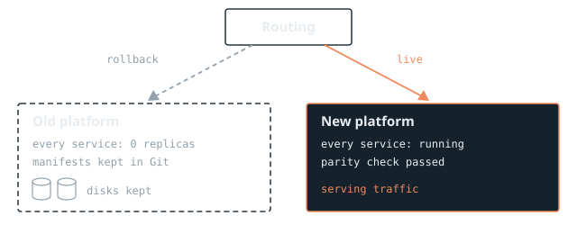

## Context

The system is an environment of about a hundred services: HTTP APIs, background workers, and a handful of services that talk to a shared message broker. It runs on a managed Kubernetes platform and is delivered through GitOps with Argo CD, so every service is described by manifests in Git and the cluster follows what is merged.

Production already ran on a different managed platform. Moving this environment onto the same platform meant one set of tooling, one way of doing networking and access, and fewer differences to reason about when something behaves differently between environments.

This wasn't the first large move for these services. The team had earlier reorganised them into domain namespaces and consolidated clusters, so the GitOps layout was already clean enough to move in pieces rather than all at once.

## Problem

Moving about a hundred services is easy to describe and hard to do safely. Services depend on each other, some share infrastructure, and the new platform differs in small ways: load balancers, storage classes, network policy defaults, and how access from outside the cluster is allowed.

Any of those differences can make a service look healthy while it answers differently from before. A pod that is running and passing its readiness probe can still return a 403 where it used to return a 200, or drop a header a client relies on. I needed a way to move everything that made those differences visible before anyone depended on the new side.

## Constraints

- **No freeze on feature work.** Teams kept shipping during the migration, so the plan had to tolerate services changing underneath it.
- **Dependencies move together.** A service that calls another inside the cluster, or that shares the message broker with others, can't move on its own without adding cross-platform latency or failure modes.
- **Rollback must stay real.** Until the last wave was proven, it had to be possible to return any wave to the old platform quickly and without rebuilding anything.
- **No manual one-offs.** Every step had to be repeatable from Git and scripts, so the last service moved the same way as the first.

## Options considered

1. **Big-bang cutover over a weekend.** Move everything in one window. It is quick on paper, but a single unexpected difference blocks every service at once, and rollback means reverting the whole environment.
2. **Per-service migration, owned by each team.** Low risk per step, but it stretches over months, leaves the environment split across two platforms for a long time, and makes cross-service dependencies everyone's problem.
3. **Waves grouped by dependency.** Move batches of services that belong together, in an order where nothing moves before what it depends on, with a check between each wave. *This is the option I chose.*

## Decision and why

I chose dependency-ordered waves, starting with a pilot. The order comes from what each service calls and shares: services that use the message broker form one wave and cut over together, and a service never moves ahead of a dependency.

Each wave is generated by one script from a single definition of which services belong to each wave, so reordering the plan is a one-line change rather than edits across many manifests. Each wave is gated by a parity check: the new side has to answer like the old side before routing moves.

```mermaid alt="Services leave the old platform through a pilot, then three waves. A parity check sits between each step and the next. A dashed rollback path leads from the waves back to the old platform." caption="Figure 1. Dependency-ordered waves, each gated by a parity check, with rollback kept open."
flowchart TD
  OLD[Old platform] --> P[Pilot]
  P -->|parity check| W1[Wave 1: broker services]
  W1 -->|parity check| W2[Wave 2]
  W2 -->|parity check| W3[Wave 3]
  W3 -.->|rollback| OLD
```

The parity checker is deliberately simple. For each service in the wave it calls the same endpoints on the old and new side and compares three things: the HTTP status, a chosen set of headers, and the shape of the JSON body. Shape means keys and types, not values, so it ignores timestamps and IDs but catches a missing field or a changed type. Any difference fails the check and prints a readable diff.

## Rollout

The pilot was a single low-risk service, moved end to end to prove the scripts, the GitOps changes and the checks. Then the team moved the broker wave in one window, followed by the remaining waves.

The cutover and retirement scripts follow one rule: show the plan, then act. Run without a confirmation flag, they print exactly what they will change: which routes switch, which workloads scale, which resources are removed. Only then do they apply it. They also record what they changed, so rolling back is a matter of replaying that state, not reconstructing it.

On the old platform, retired workloads were scaled to zero rather than deleted, and their persistent disks were kept. That made rollback cheap: scale back up, switch routing back, and the service is where it was.



## Outcome

Every service moved to the new platform in waves, with no big-bang window and without stopping feature work.

The parity checker earned its place early. On one wave it failed for a route that is only meant to be reachable from the VPN: the new side answered 403 where the old side answered 200, because that route's access rule hadn't been carried across. It was fixed before cutover, so nobody using the environment ever saw the difference.

The old platform stayed at zero replicas, with its disks, until every wave had run cleanly on the new side. Only then did the team retire it, using the same plan-then-act scripts.

## What I'd do differently

> I'd build the parity checker before the pilot, not alongside it. It turned out to be the most useful part of the migration, and having it from the first service would have made the pilot a test of the checker as well as of the platform.
>
> I'd also derive wave membership from the dependency data automatically, rather than maintaining the wave definition by hand as services changed.

## See it in code

The demo repo recreates this pattern from scratch on two local clusters, "old" and "new", both managed by Argo CD. It includes the wave generator, the parity check (status, headers and JSON shape), a cutover that prints its plan before acting, and a rollback that restores the old side. Nothing in it is copied from the system described here.
